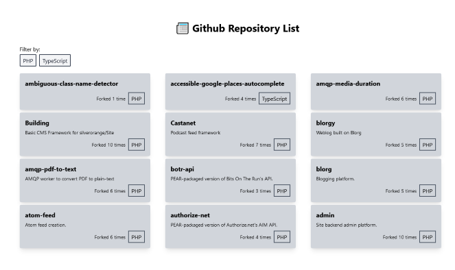
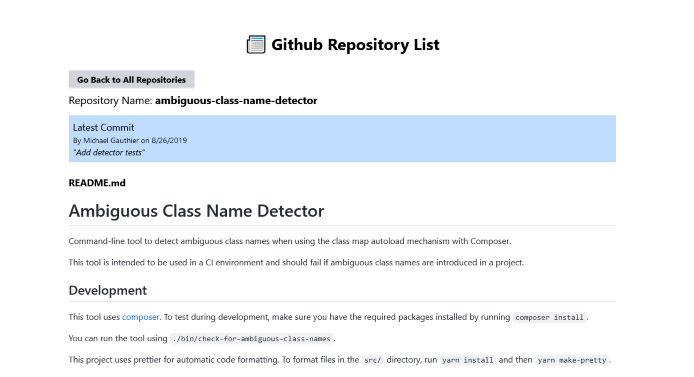

# Full Stack Express and React Project

Full stack project that uses Github API to fetch repositories using an express backend. The frontend React app displays a list of the repositories and allows users to click a single repository to get more details.

Some screenshots are provided below.




### Running the Express Application

```sh
cd api/
yarn install
yarn start
```

You can verify the API is working by visiting http://localhost:4000/repos in
your browser or another HTTP client.

## Running the React Client (/web)

To run the React frontend, you can run:

```sh
cd web/
yarn install
yarn start
```

This will open your browser at http://localhost:3000, allowing you to test the
React client.
